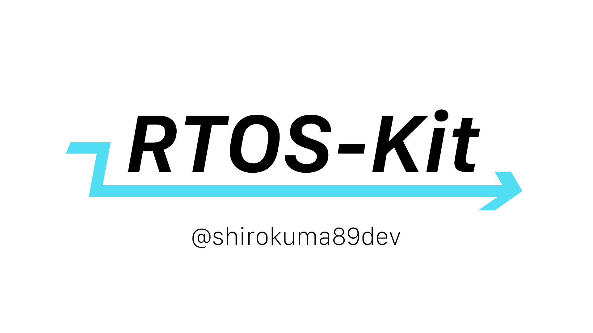

誰でも簡単にFreeRTOSで並列処理ができます！！！

STM32用です。ちょっと変えるだけでAVR系もいけるかも。

## 最新バージョン

v1.1.0

## インストール

2種類のインストール方法があります。

- PlatformIOのLibrariesで「RTOS-Kit」と検索してインストール
- このプロジェクトをダウンロードしてsrcフォルダ内をご自身のプロジェクトフォルダにコピペ


## 概念


普通だったらある処理が終わってから次の処理へ進むので、仮にTaskAの中に`delay()`などの時間待ち処理があると後のTaskBに影響を受けてしまいます。

RTOSを使うと並列に処理を行うことができるので**TaskAに時間がかかってもTaskBは影響を受けません。** 上の例だと優先度という概念があり、TaskAとTaskBが優先され、その後優先度の低いTaskCが実行されています。（例えば、TaskCの優先度をTaskA,Bと同じに設定すればTaskA,B,Cが同時に並行して実行されることになる。）

イメージとしてはパソコンで同時に複数のアプリを起動する感じです。以降、それぞれの一連の流れを集めたタスクのことをAppと呼ぶことにします。

## 使用の流れ

### 1.RTOS-Kitを#includeする

プログラムの先頭に
```cpp
#include <RTOS-Kit.h>
```
と記述してください。依存関係があるので`STM32duino FreeRTOS`もインストールしておいてください。

### 2.インスタンス作成

```cpp
RTOS_Kit app;
```

でインスタンスを作成できます。好みの名前がある方はここで指定して下さい。以降の説明はappでインスタンスを作成したものとして進めます。

### 3.Appを定義する。

Appとなる関数を定義します。お馴染みのLチカだとこのようになります。（Arduino仕様です。）

```cpp
void blinkApp(App) {
    pinMode(13, OUTPUT);
    while (1) {
        digitalWrite(13, HIGH);
        app.delay(100);
        digitalWrite(13, LOW);
        app.delay(100);
    }
}
```

- void functionName(App)で定義する。Appは忘れがちなので注意
- 中にはwhile(1)を記述して無限ループになるようにする。
- delayは全てapp.delay()にする

### 4.Appを登録する


```cpp
app.create(functionName);
```

としてRTOS側に`void buzzerApp(App)`がただの関数ではなくAppであるということを登録してください。Appは10個まで登録できます。

> **オプション:**<br>
> ```cpp
> app.create(functionName, 優先度);
> ```
> で優先度を指定できます。優先度は`firstPriority`,`secondPriority`,`defaultPriority`,`lowPriority`から選んでください。何も指定しなかった場合、自動的にdefaultPriorityが割り当てられます。

### 5.初期状態で起動するAppを指定する

このままRTOSをスタートすると何もAppが起動しない状態となってしまうので、初期状態で起動するAppを一つ以上必ず指定してください。

```cpp
app.start(funcitonName);
```

### 6.RTOS起動

```cpp
app.startRTOS();
```

でRTOSを起動します。`app.startRTOS();`以降の行に書いたプログラムは**全て無視される**ことに注意してください。**

### 7.適宜アプリを起動、一時停止

Appの起動（再開）と一時停止は

```cpp
app.start(functionName);
app.stop(functionName);
```

でできます。あくまで再開と一時停止です。初回の再開=起動という扱いです。~~再起動とか終了とかはないです。（要望あれば作ります。）~~

> **2023/06/04:**<br>
> 再起動（一旦タスクを終了して起動）対応しました! <br>
> ```cpp
> app.restart(functionName);
> ```
> でできます

## サンプル

```cpp
#include <Arduino.h>
#include <RTOS-Kit.h>

RTOS_Kit app;

void blinkApp1(App) {
    pinMode(12, OUTPUT);
    while (1) {
        digitalWrite(12, HIGH);
        app.delay(150);
        digitalWrite(12, LOW);
        app.delay(150);
    }
}

void blinkApp2(App) {
    pinMode(13, OUTPUT);
    while (1) {
        digitalWrite(13, HIGH);
        app.delay(100);
        digitalWrite(13, LOW);
        app.delay(100);
    }
}

void mainApp(App) {
    // blinkApp1
    app.start(blinkApp1);
    app.delay(3000);

    // blinkApp2
    app.stop(blinkApp1);
    app.start(blinkApp2);
    app.delay(3000);

    // Appを全て停止
    app.stop(blinkApp2);
    app.delay(3000);

    //全て再開
    app.start(blinkApp1);
    app.start(blinkApp2);

    while (1) {
    }
}

void setup() {
    app.create(mainApp, firstPriority);
    app.create(blinkApp1);
    app.create(blinkApp2);

    app.start(mainApp);  //メインアプリを初回起動に設定
    app.startRTOS();
}

void loop() {
    // Nothing to do.
}
```

## ありそうなQ&A

### delay()を使うとどうなりますか？

lowPriorityに指定したAppの動作がその間は実行されません。app.delay()だとその間にlowPriority()に指定したAppが実行されます。

### セマフォとかキューとかメモリ管理とか色々ないじゃないか！！！

これはお手軽RTOSライブラリです。詳しくて強い人は普通にRTOS使ってね。

### もっと機能増やして

Issue立てたら対応するかも

### 需要どこにあんの？

それな
